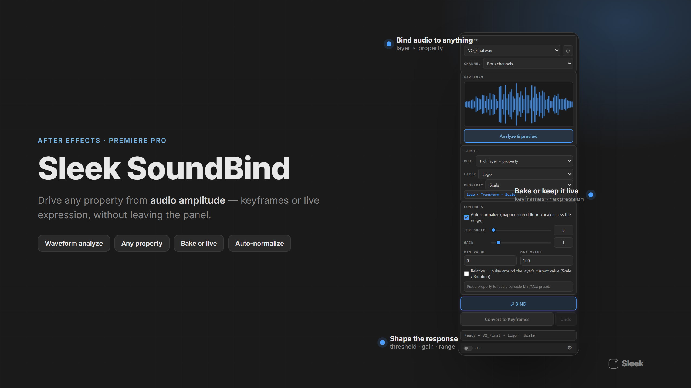

# Sleek SoundBind

**Make anything in After Effects move to the beat. Free, forever.**

Point it at an audio layer, pick the property you want to move, hit Bind — that property is audio-reactive instantly, right on the timeline.

## What's in it

- **Bind any property** — position, scale, opacity, or a brand-new Slider Control you pick-whip on the spot
- **Full mix or isolated channel** — analyze the whole track or just the left/right channel
- **Auto-normalize** — maps the track's real floor-to-peak range for you automatically
- **Live scrubbing** — every bind stays live so you can scrub and audition instantly
- **Freeze** — bake a bind into ordinary keyframes for delivery, and it leaves nothing running behind it
- **One editor view** — manage every bind on a layer from a single panel

## Install

1. Grab the latest `.zxp` from [Releases](../../releases/latest).
2. Install it with [Anastasiy's Extension Manager](https://install.anastasiy.com/) (free) — point it at the `.zxp` and let it do the rest.
3. Restart After Effects. Open the panel from **Window → Extensions → Sleek SoundBind**.

**Requires:** After Effects 2022+ · Windows & macOS

## Part of the Sleek suite

SoundBind is the audio layer for the Sleek motion suite — pairs with Sleek Looper for audio-driven stagger and Sleek Fields for audio-reactive falloffs. See the full lineup of native panels for After Effects and Blender at **[sleek-tools.com](https://sleek-tools.com)** → [SoundBind's page](https://sleek-tools.com/tools/soundbind).

## Support

Bugs and feature requests → [Issues](../../issues). Everything else → [sleek-tools.com](https://sleek-tools.com).

## License

Free to use, personally and commercially, forever — see [LICENSE.md](LICENSE.md). This repo distributes a compiled installer; it is not open-source software.
